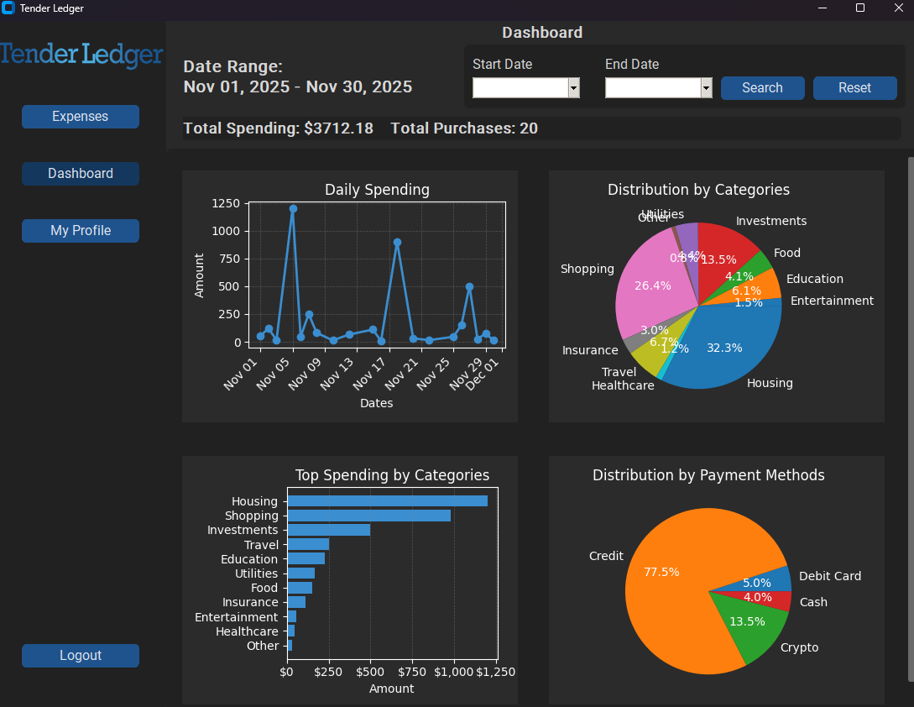
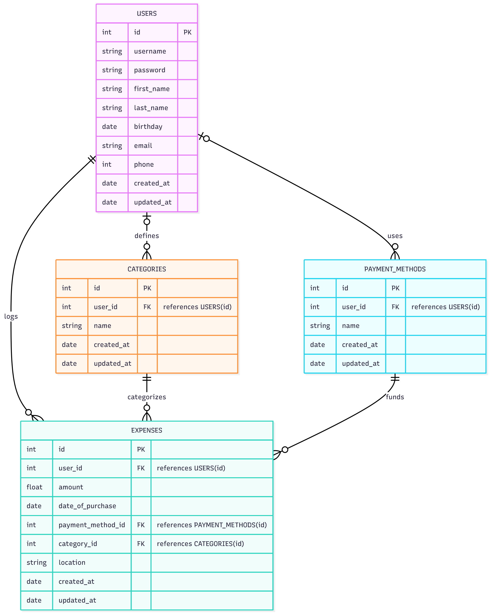

# Tender-Ledger

Tender Ledger is a personal finance and expense tracking application built in Python. The application
provides an analytics dashboard with charts to help users visualize and gain insights into their spending habits
along with data portability through CSV import and export.

    
Table of Contents

    <ol>
            <li><a href="#key-features">Key Features</a></li>
            <li><a href="#getting-started">Getting Started</a></li>
            <ul>
                <li><a href="#prerequisites">Prerequisites</a></li>
                <li><a href="#installation">Installation</a></li>
            </ul>
            <li><a href="#technical-architecture">Technical Architecture</a></li>
            <ul>
                <li><a href="#tech-stack">Tech Stack</a></li>
                <li><a href="#architecture-breakdown">Architecture Breakdown</a></li>
            </ul>
            <li><a href="#contact">Contact</a></li>
    </ol>

## Key Features
* **Secure User Authentication:** Full registration and login system with password hashing
* **Full CRUD Operations:** Easily add, view, edit, and delete expenses
*   **Interactive Data Dashboard:** Visualize spending habits with dynamic charts, including:
    *   Spending trends over time (Line Chart)
    *   Breakdowns by category and payment method (Pie Charts)
    *   Top spending categories (Bar Chart)
*   **Advanced Data Filtering:** Filter expenses by date range, category, payment method, or a text-based search.
*   **Pagination:** The expense table is fully paginated to handle large datasets smoothly.
*   **Data Portability:** Seamlessly import expenses from a CSV file and export the current view to a CSV.
*   **User Customization:** Users can create and manage their own custom spending categories and payment methods.

## Getting Started
### Prerequisites
Python 3.7+

### Installation
Just run the run.bat file

## Technical Architecture
### Tech Stack
* **Language**: Python
* **GUI Framework**: CustomTkinter
* **Database**: SQLite3
* **Data Processing**: Pandas
* **Visualization**: MatPlotlib
* **Password Hashing**: bcrypt

### Architecture Breakdown
*   **Model (The Backend):** All database interactions and business logic are encapsulated within a single `DatabaseManager` class. This class handles all CRUD operations, data filtering, and aggregation for the application.
*   **View (The GUI):** The user interface is built with CustomTkinter. Each page (Login, Expenses, Dashboard) and reusable element (Navbar, Popups) is its own separate class, promoting modularity and maintainability.
*   **Controller (The App):** The main `App` class in `main_ui.py` acts as the central controller, managing application state (like the logged-in user), handling page navigation, and orchestrating communication between the View and the Model.

### Database Schema Design

## Contact
Daniel Dang - https://www.linkedin.com/in/daniel-dang-704791a6/

https://github.com/ddang9390/Tender-Ledger